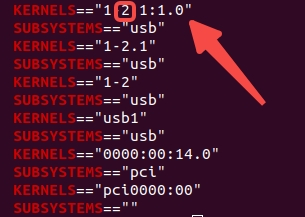

# genrobot_controller_sdk (ROS2)

## Environment Deployment
```
PC System Requirements: Ubuntu 24.04 (recommended)
Communication: ROS2 Jazzy
Configure environment according to requirements.txt
USB port must be version 3.0
```

## Enter Directory
```
cd gen_con_sdk_ros2_release
```

## Configure USB Interface

### Single Gripper USB Port Configuration
The final configuration is as shown in the figure. After configuration, this USB port can recognize any Gen Controller, and no further configuration is required. The template file is stored in
```
config/99-usb-serial.rules
```


The part that users need to modify is:


Modification method for Parameter 1:
Execute:

```
cd /dev && ls | grep ttyUSB
udevadm info -a -n /dev/ttyUSB* | grep -E "KERNELS|DRIVERS"
```

If the serial port cannot be detected:

```
sudo apt remove brltty
```

Configure the second KERNELS value from the output to Parameter 1:


Modification method for Parameter 2:
Execute:
```
v4l2-ctl --list-devices
```
Output:


Then, for the first camera of this USB, execute:
```
udevadm info -a -n /dev/video* | grep -E "KERNELS|SUBSYSTEMS"
```
Configure the first KERNELS value from the output to Parameter 2:

Then copy the template file to the following location:
```
sudo cp config/99-usb-serial.rules /etc/udev/rules.d/
```
Then load the configuration:
```
sudo udevadm control --reload-rules
sudo udevadm trigger
```

### Dual Gripper USB Port Configuration
The final configuration is as shown in the figure:


Parts to modify:


First, plug in the left gripper and configure it according to the single gripper configuration method; then unplug the left gripper, plug in the right gripper, and configure it again according to the single gripper configuration method; finally, load the configuration.

### Multiple Gripper USB Port Configuration
Similarly, add configurations to 99-usb-serial.rules.

## Build
```
cd gen_con_sdk_ros2_release
source /opt/ros/jazzy/setup.bash
colcon build --symlink-install --base-paths src/robot_driver
source install/setup.bash
```

## Single Gripper Startup
```
ros2 launch robot_driver single_gripper_start.launch.py
```

After startup, three image windows will pop up, and the output topics are:
```
/camera/color/image_raw     # Center camera
/camera_1/color/image_raw   # Left-side camera
/camera_2/color/image_raw   # Right-side camera
/encoder                    # Actual gripper opening/closing distance feedback
/tactile/left               # Left-side tactile sensor of gripper
/tactile/right              # Right-side tactile sensor of gripper
/target_distance            # Gripper opening/closing distance command
```

### Start demo script to receive commands and control gripper opening/closing
```
# /target_distance : The input distance range is [0.0, 0.103], meaning it can open up to 10 cm.
ros2 run robot_driver left_das_controller_infer
```

## Dual Gripper Startup
```
ros2 launch robot_driver dual_gripper_start.launch.py
```

After startup, six image windows will pop up, and the output topics are:
```
/left_gripper/camera/color/image_raw    # Left gripper center camera
/left_gripper/camera_1/color/image_raw  # Left gripper left-side camera
/left_gripper/camera_2/color/image_raw  # Left gripper right-side camera
/left_gripper/encoder                   # Left gripper actual opening/closing distance feedback
/left_gripper/tactile/left              # Left gripper left-side tactile sensor
/left_gripper/tactile/right             # Left gripper right-side tactile sensor
/left_gripper/target_distance           # Left gripper opening/closing distance command

/right_gripper/camera/color/image_raw   # Right gripper center camera
/right_gripper/camera_1/color/image_raw # Right gripper left-side camera
/right_gripper/camera_2/color/image_raw # Right gripper right-side camera
/right_gripper/encoder                  # Right gripper actual opening/closing distance feedback
/right_gripper/tactile/left             # Right gripper left-side tactile sensor
/right_gripper/tactile/right            # Right gripper right-side tactile sensor
/right_gripper/target_distance          # Right gripper opening/closing distance command
```

### Start demo script to receive commands and control gripper opening/closing. Left gripper and right gripper control commands:
```
# /left_gripper/target_distance and /right_gripper/target_distance : The input distance range is [0.0, 0.103], meaning it can open up to 10 cm.
ros2 run robot_driver left_das_controller_infer
ros2 run robot_driver right_das_controller_infer
```

## Single Device Mode
```
# ROS2 does not need roscore, but the same USB device can still only be opened by one process at a time.
cd src/robot_driver/scripts/
bash camera_cmd.sh camerarc  # Get center camera calibration data
bash camera_cmd.sh camerarl  # Get left camera calibration data
bash camera_cmd.sh camerarr  # Get right camera calibration data
bash camera_cmd.sh MCUID     # Get device ID
ros2 run robot_driver tactile_dual_print   # Read Tactile Data
# When using V4 Controller, set fps to 60 (for units shipped after April 2026):
# ros2 launch robot_driver single_gripper_start.launch.py  # After startup, set via parameter: ros2 param set /camera fps 60
```
Example of getting device ID:


## Multi-Device Mode
```
Two devices (left/right distinction):
cd src/robot_driver/scripts/

bash camera_cmd.sh left camerarc  # Get left device center camera calibration data
bash camera_cmd.sh left camerarl  # Get left device left camera calibration data
bash camera_cmd.sh left camerarr  # Get left device right camera calibration data
bash camera_cmd.sh left MCUID     # Get left device ID
ros2 run robot_driver tactile_dual_print --ros-args -p gripper_ns:=left_gripper   # Read left Tactile Data

bash camera_cmd.sh right camerarc  # Get right device center camera calibration data
bash camera_cmd.sh right camerarl  # Get right device left camera calibration data
bash camera_cmd.sh right camerarr  # Get right device right camera calibration data
bash camera_cmd.sh right MCUID     # Get right device ID
ros2 run robot_driver tactile_dual_print --ros-args -p gripper_ns:=right_gripper  # Read right Tactile Data
```
